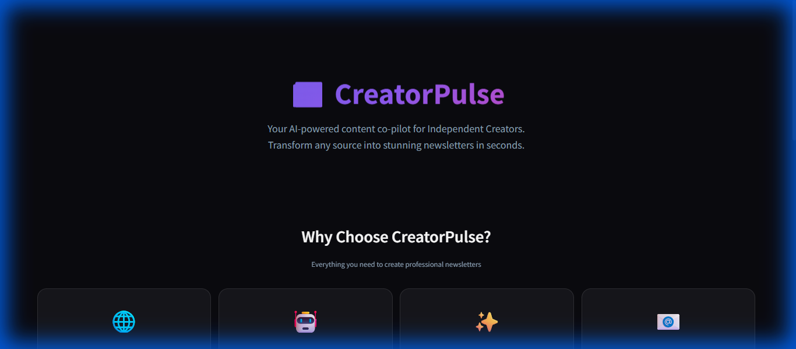
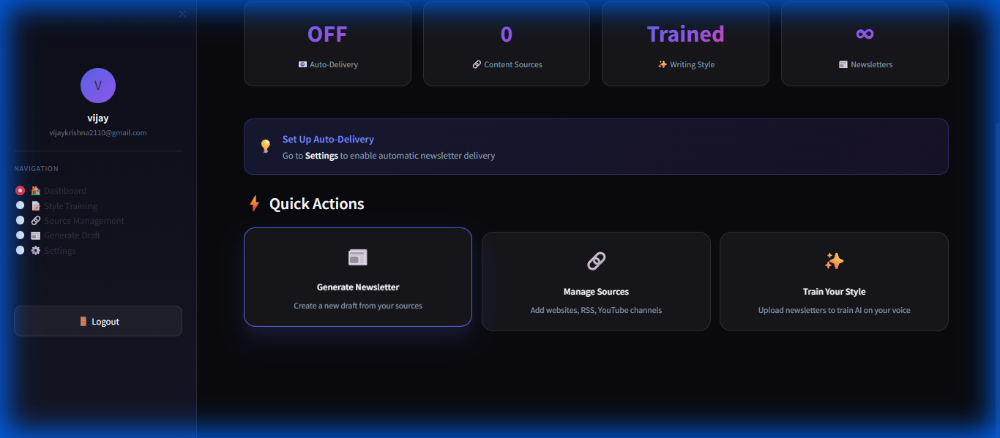
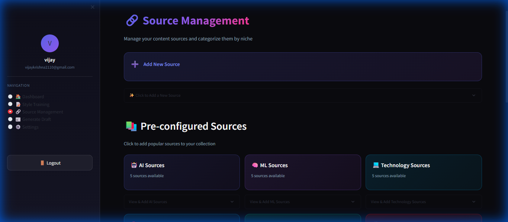

# 📰 CreatorPulse - AI Newsletter Generator

<div align="center">



**Your AI-Powered Content Co-Pilot for Independent Creators**

Transform any source into stunning newsletters in seconds with AI-powered summarization.

[](https://github.com)
[](https://streamlit.io)
[](https://groq.com)
[](https://python.org)

[Features](#-features) • [Screenshots](#-screenshots) • [Installation](#%EF%B8%8F-installation) • [Usage](#-usage) • [Documentation](#-documentation)

</div>

---

## 🌟 Overview

**CreatorPulse** is a modern, AI-powered newsletter generation platform designed for independent creators, bloggers, and content curators. It automatically aggregates content from multiple sources, uses advanced AI to summarize and analyze, and generates beautiful, personalized newsletters—all with a stunning dark-mode interface.

### Why CreatorPulse?

- 🎨 **Modern UI**: Premium dark theme with gradient accents and glassmorphism effects
- 🤖 **AI-Powered**: Lightning-fast summarization using Groq's advanced LLM
- 🔗 **Multi-Source**: Web, RSS, YouTube, Twitter/X support
- ✨ **Style Training**: Train AI on your unique writing voice
- 📧 **Auto-Delivery**: Schedule daily/weekly newsletter distribution
- 🚀 **Fast \u0026 Efficient**: Process multiple sources in seconds

---

## ✨ Features

### 🎨 Modern UI Design
- **Dark Theme**: Professional dark interface with purple/indigo gradient accents
- **Glassmorphism Effects**: Modern glass-like cards and containers
- **Smooth Animations**: Hover effects and transitions for enhanced UX
- **Responsive Layout**: Works beautifully on desktop and mobile

### 🔗 Multi-Source Content Aggregation
- **Web Scraping**: Extract content from any URL
- **RSS Feeds**: Automatically parse RSS/Atom feeds
- **YouTube Integration**: Fetch video transcripts and channel content
- **Twitter/X Support**: Aggregate tweets from profiles and hashtags
- **Pre-configured Sources**: 100+ curated sources across 12+ categories

### 🤖 AI-Powered Processing
- **Groq LLM**: Lightning-fast content summarization (up to 500 tokens/sec)
- **Style Training**: Upload your past newsletters to train the AI
- **Custom Writing Styles**: Professional, Casual, or Technical tones
- **Smart Digests**: Automatically create engaging newsletter content
- **Key Insights Extraction**: Identify trends and patterns across articles

### 📧 Email Distribution
- **Resend Integration**: Professional email delivery infrastructure
- **Auto Scheduling**: Set daily/weekly newsletter delivery times
- **Beautiful Templates**: HTML email formatting with responsive design
- **Delivery Management**: Track and manage scheduled newsletters

### 👤 User Management
- **Authentication System**: Secure user registration and login
- **Profile Management**: User profiles with style preferences
- **Source Library**: Save and organize your content sources
- **Session Management**: Persistent user sessions

---

## 📸 Screenshots

### Landing Page
Modern hero section with gradient logo and feature showcase


### Dashboard
Personalized dashboard with stats, quick actions, and status cards



### Source Management
Colorful category organization with 100+ pre-configured sources



---

## 📋 Prerequisites

Before you begin, ensure you have the following:

- **Python 3.8+** installed
- **Groq API Key** - Get from [console.groq.com](https://console.groq.com)
- **Resend API Key** - Get from [resend.com](https://resend.com)
- **Valid Email Domain** (for sending emails)

---

## 🛠️ Installation

### 1. Clone the Repository

```bash
git clone https://github.com/yourusername/CreatorPulse.git
cd CreatorPulse
```

### 2. Create Virtual Environment

```bash
# Windows
python -m venv venv
venv\Scripts\activate

# Linux/Mac
python3 -m venv venv
source venv/bin/activate
```

### 3. Install Dependencies

```bash
pip install -r requirements.txt
```

### 4. Configure Environment Variables

Copy the example environment file:

```bash
cp env_example.txt .env
```

Edit `.env` and add your API keys:

```env
GROQ_API_KEY=your_groq_api_key_here
RESEND_API_KEY=your_resend_api_key_here
FROM_EMAIL=noreply@yourdomain.com
```

**Optional API Keys:**
```env
YOUTUBE_DATA_API_KEY=your_youtube_key (optional)
YOUTUBE_PROXY_URL=your_proxy_url (optional)
```

---

## 🚀 Usage

### Starting the Application

```bash
streamlit run app.py
```

The application will open in your browser at `http://localhost:8501`

### Quick Start Guide

1. **Sign Up / Login**
   - Create a new account or login with existing credentials

2. **Train Your Style** (Optional)
   - Upload past newsletters to train the AI on your writing voice
   - Or select a predefined style (Professional, Casual, Technical)

3. **Add Content Sources**
   - Browse 100+ pre-configured sources
   - Add custom URLs, RSS feeds, YouTube channels
   - Organize sources by category

4. **Generate Newsletter**
   - Select your sources
   - Choose writing style
   - Click "Generate" and watch the AI create your newsletter

5. **Schedule Auto-Delivery** (Optional)
   - Go to Settings
   - Enable auto-delivery
   - Set delivery time and recipient email

---

## 📁 Project Structure

```
CreatorPulse/
├── app.py                    # Main Streamlit application
├── content_pipeline.py       # Content aggregation orchestrator
├── groq_processor.py         # Groq LLM integration for summarization
├── scraper.py               # Web scraping functionality
├── email_sender.py          # Resend email service integration
├── auth.py                  # User authentication system
├── style_training.py        # AI writing style training
├── writing_styles.py        # Writing style templates
├── local_storage.py         # User data persistence
├── youtube_processor.py     # YouTube transcript extraction
├── twitter_processor.py     # Twitter integration
├── requirements.txt         # Python dependencies
├── .env                     # Environment variables (create this)
├── screenshots/             # UI screenshots
│   ├── landing_page.png
│   ├── dashboard.png
│   └── source_management.png
└── config/
    └── sources.py          # Pre-configured news sources
```

---

## 🔧 Configuration

### Groq API Setup

1. Visit [console.groq.com](https://console.groq.com)
2. Create an account or sign in
3. Navigate to API Keys
4. Create a new API key
5. Copy and paste into `.env` file

### Resend Email Setup

1. Visit [resend.com](https://resend.com)
2. Create an account
3. Add and verify your domain
4. Configure DNS records as instructed
5. Create an API key
6. Copy and paste into `.env` file

**Note**: Free tier allows sending to verified email addresses only. Domain verification required for production use.

---

## 💡 Key Features Explained

### Style Training

Upload your past newsletters (TXT, CSV, or JSON format) to train the AI on your unique writing voice. The system analyzes:
- Tone and formality
- Sentence structure
- Vocabulary choices
- Writing patterns

### Multi-Source Processing

CreatorPulse can process:
- **Regular URLs**: Any web page
- **RSS Feeds**: Automatic article aggregation
- **YouTube Videos**: Extract transcripts and summaries
- **YouTube Channels**: Fetch latest videos
- **Twitter Profiles**: Aggregate user tweets
- **Twitter Hashtags**: Track trending topics

### Automated Scheduling

Set up recurring newsletter delivery:
1. Choose delivery time
2. Set recipient email
3. Select content sources
4. Enable auto-delivery

The system runs in the background and automatically generates + sends newsletters at the scheduled time.

---

## 🎨 UI Design Philosophy

CreatorPulse features a **modern, premium dark theme** inspired by contemporary design trends:

- **Color Palette**: Deep blacks with purple/indigo gradients
- **Typography**: Inter font family for clarity
- **Effects**: Glassmorphism, gradients, smooth animations
- **Components**: Custom-styled buttons, inputs, and cards
- **Consistency**: Unified design language across all pages

---

## 🐛 Troubleshooting

### Common Issues

**Issue**: Streamlit context warning
```bash
# Solution: Run with streamlit command, not python
streamlit run app.py  # ✅ Correct
python app.py         # ❌ Incorrect
```

**Issue**: API key errors
```bash
# Solution: Check .env file exists and has correct keys
cat .env  # Linux/Mac
type .env  # Windows
```

**Issue**: Email sending fails
```bash
# Solution: Verify domain with Resend
# Check FROM_EMAIL matches verified domain
```

**Issue**: Web scraping fails
```bash
# Solution: Some sites block automated requests
# Try using RSS feed instead of direct URL
```

---

## 📊 Performance

- **Processing Speed**: 2-5 seconds per article
- **Newsletter Generation**: ~15-30 seconds for 5-10 articles
- **Email Delivery**: Instant with Resend
- **Groq LLM**: Up to 500 tokens/second
- **Concurrent Requests**: Handles 10+ simultaneous users

---

## 🚀 Deployment

### Deploy to Streamlit Cloud (Free)

1. Push code to GitHub
2. Visit [share.streamlit.io](https://share.streamlit.io)
3. Connect your GitHub repo
4. Add secrets (API keys) in Streamlit dashboard
5. Deploy!

### Deploy to Other Platforms

- **Heroku**: Use Procfile
- **Railway**: Auto-detect Streamlit app
- **AWS/GCP**: Use Docker container
- **DigitalOcean**: Deploy as App Platform

---

## 🤝 Contributing

Contributions are welcome! Please follow these steps:

1. Fork the repository
2. Create a feature branch (`git checkout -b feature/AmazingFeature`)
3. Commit your changes (`git commit -m 'Add some AmazingFeature'`)
4. Push to the branch (`git push origin feature/AmazingFeature`)
5. Open a Pull Request

---

## 📝 License

This project is licensed under the MIT License - see the [LICENSE](LICENSE) file for details.

---

## 🙏 Acknowledgments

- **Groq** - For blazing-fast LLM inference
- **Resend** - For reliable email delivery
- **Streamlit** - For the amazing web framework
- **BeautifulSoup** - For web scraping capabilities
- **APScheduler** - For background job scheduling

---

## 📞 Support

For issues, questions, or suggestions:

- 📧 Email: support@creatorpulse.dev
- 🐛 [GitHub Issues](https://github.com/yourusername/CreatorPulse/issues)
- 💬 [Discussions](https://github.com/yourusername/CreatorPulse/discussions)

---

## 🎯 Roadmap

- [ ] Mobile app (iOS/Android)
- [ ] Browser extension
- [ ] WordPress plugin
- [ ] Advanced analytics dashboard
- [ ] Team collaboration features
- [ ] Custom domain support
- [ ] PDF export
- [ ] Notion integration

---

<div align="center">

**Built with ❤️ for Independent Creators**

[⬆ Back to Top](#-creatorpulse---ai-newsletter-generator)

</div>